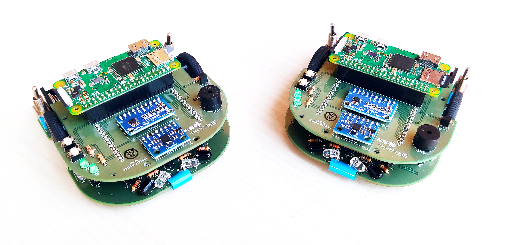
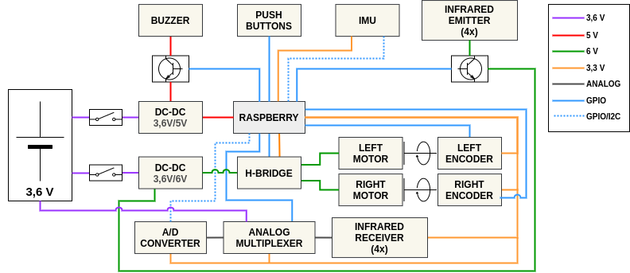
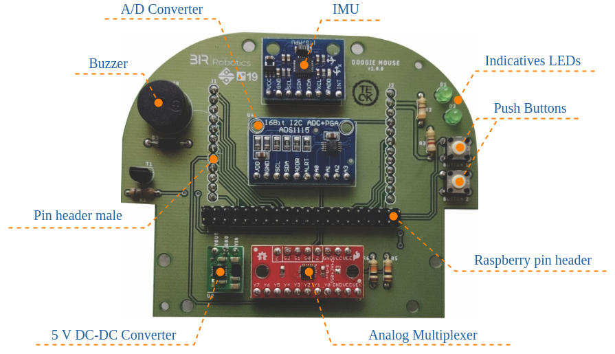
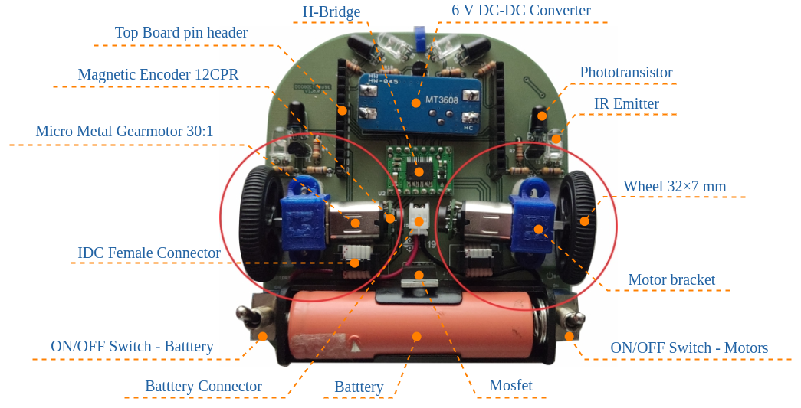

# Doogie Hardware
This repository is intend to gather all the files regarding the Doogie Mouse robot hardware and briefly explain about robot's electronic architecture.

## Folder organization
- [Eagle]\: [Autocad Eagle] files (*.sch and *.brd) of top and bottom boards and a file used to check design rules (.dru)
- [Gerbers]\: Files used to manufacture the top and bottom boards
- [Libraries]\: Eagle libraries used in the layout of the Doogie Mouse robot boards
- [Schematics]\: Electronic schematics of top and bottom board in PDF format
- [BOM]\: Bill Of Materials

## Electronic architecture
The electronic architecture in the figure below demonstrates how Doogie Mousee components are electrically interconnected. For the purpose of better visualization, the voltage reference (Ground - GND) was omitted.

<b>Figure 1: </b>Electronic architecture 
 
 

The Doogie is equipped with a Li-Ion battery with 3.6 V of nominal voltage. To make the battery voltage level compatible with the other components, two DC-DC converters are used. The first will supply 6 V exclusively for motors and emitting LEDs. The second is responsible for supplying the Raspberry Pi with 5 V. However, the components that are connected to the Raspberry Pi are powered by 3.3 V through an internal DC-DC converter on the microprocessor system board.

In order to facilitate the replication of the robot by users who want to use it, it was decided to use breakout boards, which are pre-assembled electronic boards. Doogie has six of them: two DC-DC voltage converters, an A/D converter, an IMU, an analog multiplexer and an H-Bridge. The other components, such as resistors, transistors, infrared LEDs, phototransistors and connectors, are soldered directly on the PCB.

Doogie components communicate and are controlled in several ways. The A/D converter and the IMU communicate with the Raspberry Pi via an I2C bus. As the specified A/D converter has only 4 channels (one for each infrared sensor), it was decided to use an analog multiplexer to allow the battery voltage value to be obtained as well. This multiplexer is controlled by digital pins from the processing unit. Finally, the control of the motors is performed by an H bridge with two independent channels. This power driver allows the directions of rotation of the motors to be controlled by digital pins from the Raspberry Pi while the speed control is performed by PWM.

For detailed description of components connections, see the electronic schematics [doogie_bottom_board](Schematics/doogie_bottom_board.pdf) and [doogie_top_board](Schematics/doogie_top_board.pdf).

## Boards overview

<b>Top Board</b>
 
 

<b>Bottom Board</b>
 
 

## Assembly Instructions
See [Hardware Setup] on Doogie wiki page!

## Purpose of the Project

Doogie Mouse platform was originally developed in 2019 as an undergraduate thesis (Theoprax methodoly) at Centro Universitário SENAI CIMATEC in partnership with Brazillian Institute of Robotics, for teaching principles of artificial intelligence using high level framework for writing and reusing robot software.

It's a open source project and expects modifications and contributions from it's users. 

## Change Log
#### [1.0] - 2019-12-10
- First version

## Bugs & Feature Requests
Please report bugs and request features using the [Issue Tracker](https://github.com/Brazilian-Institute-of-Robotics/doogie_hardware/issues).

[Eagle]: https://github.com/Brazilian-Institute-of-Robotics/doogie_hardware/tree/master/Eagle
[Autocad Eagle]: https://www.autodesk.com/products/eagle/overview?geoNavigationPreferredSite=US
[Gerbers]: https://github.com/Brazilian-Institute-of-Robotics/doogie_hardware/tree/master/Gerbers
[Libraries]: https://github.com/Brazilian-Institute-of-Robotics/doogie_hardware/tree/master/Libraries
[Schematics]: https://github.com/Brazilian-Institute-of-Robotics/doogie_hardware/tree/master/Schematics
[BOM]: https://github.com/Brazilian-Institute-of-Robotics/doogie_hardware/tree/master/BOM
[Hardware Setup]: https://github.com/Brazilian-Institute-of-Robotics/doogie/wiki/Hardware-Setup
